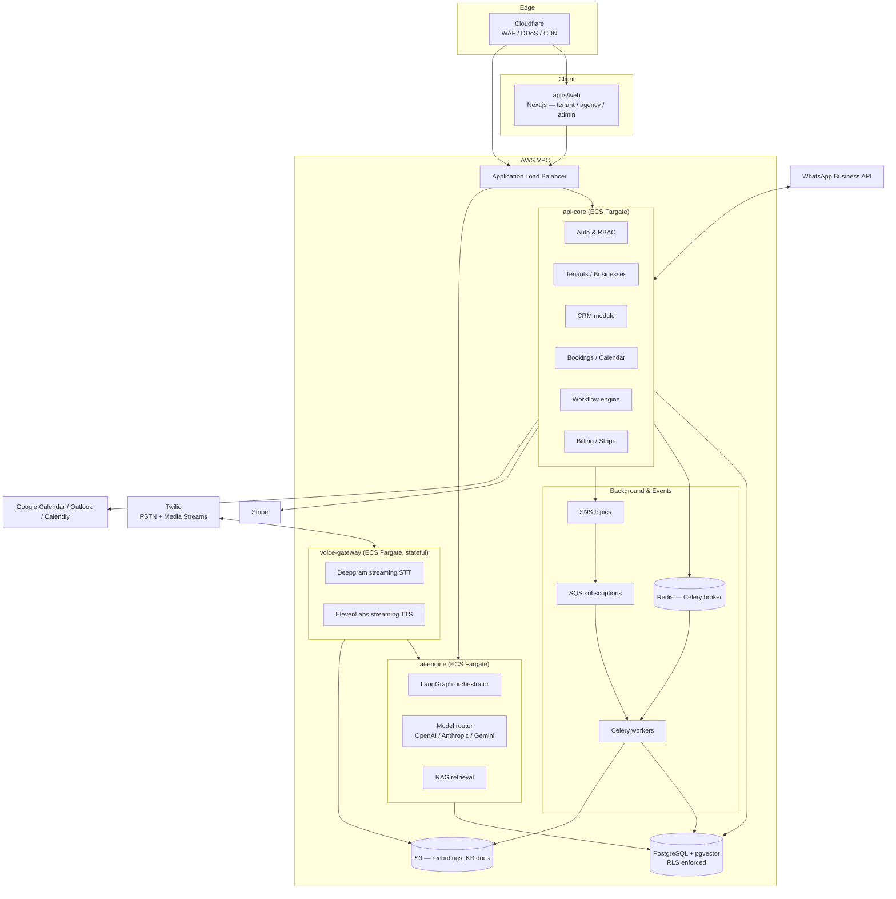

# Pluto AI — System Architecture (v1)

Status: **Draft for review — Phase 1**
Owner: Architecture
Last updated: 2026-07-24

This document is the canonical architecture reference for Pluto AI. It defines *why* each major
decision was made, not just what was chosen. Every decision that has a real tradeoff is written as
Options → Tradeoff → Recommendation, per engineering standard for this project. Nothing here is
final until reviewed — this is the artifact we iterate on before any service code is written.

---

## 1. What we're building

Pluto AI is a multi-tenant SaaS platform where each tenant ("Business") gets an AI agent that
answers phone calls, WhatsApp, SMS, and web chat; books appointments; qualifies leads; syncs to a
CRM; and executes configurable workflows. On top of that sits an **Agency** layer for
white-labeling to resellers, and a **Platform** layer for internal operations (billing, support,
abuse control, feature rollout).

Three tenancy levels, not two:

```
Platform (us)
 └── Agency (reseller / white-label partner)        [optional — a Business can have no Agency]
      └── Business (the actual SME customer)
           └── Users (owner, admin, staff, read-only)
```

This third level (Agency) is a first-class citizen in the data model from day one — retrofitting a
reseller hierarchy into a two-level tenant model later is a schema migration that touches every
table with a `tenant_id`. Cheap now, expensive later.

## 2. Guiding constraint

Every decision below is evaluated against: **does this still work at 100,000 businesses, each with
their own phone number, knowledge base, and call volume, with p95 voice-response latency under
2 seconds?** Where a decision trades near-term velocity for that, we say so explicitly.

---

## 3. Decision 1 — Monolith vs. microservices at launch

**Options**

| | Full microservices from day 1 | Single monolith forever | Modular monolith + strategic service extraction |
|---|---|---|---|
| Time to first customer | Slow — N services, N deploy pipelines, N sets of infra before a single call can be answered | Fast | Fast |
| Ops burden at 10 employees | Very high (service mesh, N on-call surfaces) | Low | Low–medium |
| Ceiling at 100k tenants | Highest | Breaks — one slow endpoint blocks all traffic, one bad deploy risks everything, background job load competes with request-serving CPU/memory | High, if extraction seams are honored |
| Voice latency risk | Low — voice gets its own runtime naturally | High — GC pauses / connection pool contention from unrelated traffic can blow the 2s budget | Low, because voice is extracted from day 1 |

**Recommendation: modular monolith with two mandatory day-1 extractions.**

The core business logic (auth, tenants, businesses, CRM, bookings, workflows, billing, admin) ships
as **one FastAPI service (`api-core`)**, internally organized into bounded-context modules with no
cross-module imports of internals (only through module-level service interfaces). This is fast to
build and simple to operate while the team is small.

Two things are **not** allowed to live in `api-core`, because their scaling and latency profiles are
categorically different from a REST CRUD service:

- **`voice-gateway`** — long-lived WebSocket connections (one per active call), CPU-bound audio
  streaming, and a hard 2-second latency budget. Mixing this runtime with `api-core`'s request/response
  traffic means a burst of dashboard traffic can starve an active phone call, or a slow SQL query in
  the CRM module can add jitter to speech-to-text. This is extracted from day 1.
- **`workers`** (Celery) — background jobs (embeddings, transcription post-processing, CRM sync,
  outbound notifications) already run in a separate process pool per the stated stack, so this
  extraction is essentially free and prevents batch workloads from competing with API request CPU.

Everything else stays in the monolith until a specific module has a proven independent scaling need
(the most likely early candidate is `ai-engine`, which is why it's scaffolded as a separate service
folder now — see §5 — even though it can be deployed as a library inside `api-core` initially and
split into its own network service once GPU/inference-cost isolation matters).

**Why not full microservices now:** at zero customers, the bottleneck is engineering iteration
speed, not request throughput. A service boundary you don't need yet costs you a deploy pipeline,
a service discovery entry, a set of IAM roles, and a new failure mode, for zero benefit. The
extraction seams (clean module interfaces, no shared mutable state, no direct cross-module DB
writes) are enforced from day 1 specifically so that splitting `api-core` into more services later
is a mechanical refactor, not a rewrite.

---

## 4. Decision 2 — Multi-tenancy & data isolation

**Options**

| | Database-per-tenant | Schema-per-tenant | Shared schema, `tenant_id` column + Postgres Row-Level Security |
|---|---|---|---|
| Isolation strength | Strongest | Strong | Strong, if RLS is enforced at the DB and never bypassed |
| Migrations at 100k tenants | Must run N times or via fan-out tooling — operationally brutal | Same problem, slightly cheaper | One migration, applies to everyone |
| Connection pool cost | One pool per tenant (or heavy pool multiplexing) — exhausts Postgres `max_connections` long before 100k tenants | Better, still O(tenants) schemas to manage | One pool, shared efficiently via PgBouncer |
| Cross-tenant analytics / platform admin queries | Requires fan-out across N databases | Requires fan-out across N schemas | Single query |
| Noisy-neighbor blast radius | Contained to one tenant's DB | Contained to one tenant's schema | A pathological query without `tenant_id` in the `WHERE`/index path can scan more broadly — mitigated by RLS + mandatory tenant-scoped indexes |
| Precedent at this scale | Used by very high-isolation-requirement products (e.g. regulated single-tenant deployments) | Common at small-to-mid scale, falls over past a few thousand tenants | Standard for large-scale multi-tenant SaaS (this is how most 100k+ tenant platforms operate) |

**Recommendation: shared schema, every tenant-owned table carries a `business_id` (and `agency_id`
where relevant), enforced with Postgres Row-Level Security as defense-in-depth behind
application-layer scoping.**

Concretely:

- Every request resolves a `tenant_context` (business_id, agency_id, user_id, role) from the JWT
  before touching the database.
- `SET LOCAL app.current_tenant = '<business_id>'` is issued at the start of every DB transaction;
  RLS policies on every tenant-owned table enforce `business_id = current_setting('app.current_tenant')::uuid`.
  This means even a bug that forgets a `WHERE business_id = ...` clause in application code **cannot**
  leak cross-tenant rows — the database refuses the rows at the policy layer. This is the single
  most important control against the #1 SaaS security failure mode (tenant data leakage from a
  missed filter).
- Composite indexes are always `(business_id, ...)` leading, so per-tenant queries stay cheap
  regardless of total platform row count.
- **Isolation tiers as an escape hatch, not the default:** large enterprise or compliance-sensitive
  customers (and white-label Agencies who demand it contractually) can be placed on a dedicated
  Postgres cluster later via the same schema, just pointed at a different connection string per
  tenant-group — the application code doesn't change, only a tenant→shard routing lookup does. We
  are not building this routing layer in Phase 1; we are making sure nothing in Phase 1 prevents
  adding it later (no tenant identifiers baked in as, e.g., sequential integers scoped to a single
  DB instance — all tenant and business-owned primary keys are UUIDv7 for this reason, see §6).

---

## 5. Decision 3 — Event backbone (async communication between services)

**Options**

| | Kafka / MSK | SNS + SQS | Redis Streams |
|---|---|---|---|
| Ops overhead at small team | High (partitions, consumer groups, broker sizing) | Near zero (fully managed) | Low, but it's already carrying Celery's broker load |
| Durability / replay | Best — long retention, replay by offset | Good — SQS retains up to 14 days, no arbitrary replay | Weak — meant for stream processing, not a durable event log; not appropriate as the system of record for events |
| Scale ceiling | Very high | Very high (AWS-managed, scales horizontally) | Bounded by single Redis instance/cluster memory |
| Fits existing AWS-native stack | Yes | Yes, most natively | Yes (already required for Celery) |

**Recommendation: SNS/SQS for cross-service domain events now; Celery/Redis stays scoped to
task queuing (not event distribution); revisit Kafka/MSK when event volume or replay/read-model
requirements justify the operational cost (realistic trigger: sustained >5k events/sec platform-wide,
or a need for event sourcing with arbitrary historical replay — neither is true at launch or at
low-thousands of tenants).**

Domain events (`call.completed`, `booking.created`, `lead.qualified`, `conversation.escalated`,
etc.) are published to SNS topics; each interested consumer (CRM sync worker, analytics pipeline,
webhook dispatcher, notification service) owns an SQS subscription. This decouples "a call ended"
from "everything that needs to happen because a call ended" — new consumers (e.g., a future
Slack-notification feature) subscribe without touching the call-handling code path at all.

Celery+Redis remains exactly what the stated stack says: the task queue for background *work*
(send this email, generate this embedding, transcribe this recording) — a different concern from
*event distribution* between services, even though both ride on asynchronous messaging.

---

## 6. Decision 4 — Primary keys & IDs

All tenant-owned entity primary keys are **UUIDv7** (time-ordered UUIDs), not auto-increment
integers and not UUIDv4.

- vs. auto-increment int: integers leak business intelligence (competitors can estimate signup
  volume from ID gaps) and don't survive a future database-per-tenant-shard split for enterprise
  customers.
- vs. UUIDv4: UUIDv7 is time-sortable, which keeps B-tree index insert patterns sequential
  (avoiding the random-insert index bloat that plain UUIDv4 causes at high write volume — material
  at 100k tenants generating millions of call/conversation rows).

---

## 7. Decision 5 — Compute & deployment platform

**Options**

| | AWS EKS (Kubernetes) | AWS ECS Fargate |
|---|---|---|
| Flexibility / ecosystem | Maximum — full k8s ecosystem, portable off AWS | AWS-native only |
| Operational complexity | High — needs a dedicated platform/SRE function to run safely in production | Low — AWS manages the control plane, node patching, bin-packing |
| Time to production-grade | Weeks of cluster hardening (network policy, RBAC, autoscaler tuning, admission control) before it's actually production-safe | Days — task definitions + ALB + autoscaling policies |
| Scale ceiling | Effectively unlimited | Effectively unlimited for our workload shape (stateless HTTP services + worker pools); the one thing Fargate can't do well is `voice-gateway`'s long-lived stateful WebSocket connections at very high concurrency, which is a Decision 7 concern, not a Fargate-vs-EKS one |
| Team fit right now | Requires SRE headcount we don't have yet | Fits a small team |

**Recommendation: ECS Fargate now, containers built so an EKS migration later is a Terraform
change, not an application rewrite.**

Everything ships as a Docker image regardless of orchestrator, and Terraform modules are written
with the orchestrator as a swappable layer (task-definition-equivalents). This is exactly the
speed-vs-scalability tradeoff the project brief asks to call out explicitly: Kubernetes is the
"correct" long-run answer for a platform aiming at unicorn scale, but adopting it before there's a
platform team to run it correctly is a common way early-stage SaaS companies create an outage
generator instead of a scaling advantage. We revisit EKS when either (a) we need workload
portability across clouds, or (b) Fargate's per-task limits (CPU/memory ceilings, no DaemonSets,
limited sidecar patterns) start constraining a specific service — most likely `voice-gateway` at
very high concurrent-call counts, at which point a dedicated EC2/EKS node group for that one
service (hybrid, not a full migration) is the likely first step, not a wholesale EKS adoption.

**Edge / ingress:** Cloudflare (DNS, WAF, DDoS protection, CDN for static frontend assets) →
AWS ALB → ECS services. Cloudflare also terminates and rate-limits at the edge before traffic ever
reaches our infrastructure, which matters once phone-number-based abuse (robocall-style traffic
patterns) becomes a threat model at scale.

---

## 8. Decision 6 — Frontend app topology

**Options**

| | Three separate Next.js apps (web, admin, agency) | One Next.js app, role-based routing/layouts |
|---|---|---|
| Code/component reuse | Requires a shared `packages/ui` and discipline to avoid drift | Natural — same app, same components |
| Independent deploy cadence | Yes — admin can ship without touching tenant-facing app | No |
| Blast radius of a bad deploy | Contained per app | A bug in admin routing can't take down the tenant dashboard, but they do share a build/deploy pipeline |
| Complexity for a small team | Three build pipelines, three sets of env config, three domains to manage | One |

**Recommendation: one Next.js app (`apps/web`) with role-based route groups
(`/app/(tenant)`, `/app/(agency)`, `/app/(platform-admin)`), not three separate apps.**

The failure mode of three-apps-from-day-1 is component and design-system drift long before there's
enough admin- or agency-specific functionality to justify separate deploy pipelines. The route
groups give clean separation of layouts, auth guards, and code-splitting (Next.js only ships the JS
for the route group being visited) without the multi-repo-like overhead. We revisit a split once
the admin or agency surface has its own release cadence and team ownership that's actually blocked
by shipping through the same pipeline — not before. The scaffolded `apps/admin` and `apps/agency`
folders are placeholders for that future split and are not built out in Phase 2.

*(Correction applied: the folder structure created in this repo reflects this — `apps/admin` and
`apps/agency` will be removed in favor of route groups inside `apps/web` when Phase 2 frontend work
starts, unless this decision is overridden on review.)*

---

## 9. Decision 7 — Voice pipeline runtime shape

Covered in depth in [`03-ai-and-voice-architecture.md`](./03-ai-and-voice-architecture.md). Summary
of the placement decision: `voice-gateway` is a stateful service (one long-lived process per active
call, holding an open Twilio Media Stream WebSocket, a streaming Deepgram connection, and a
streaming TTS connection concurrently) and is deployed on ECS Fargate with **call-affinity, not
request-affinity** — once a call is routed to a task, all audio frames for that call's lifetime stay
on that task. Horizontal scaling adds tasks; the ALB (or a lightweight self-hosted call router in
front of it) assigns *new* calls to the least-loaded task rather than load-balancing per-request.

---

## 10. Decision 8 — Vector search / RAG storage

Per the stated stack, **pgvector** (not a dedicated vector DB like Pinecone/Weaviate).

**Why this holds at scale:** each tenant's knowledge base is small in isolation (dozens to low
thousands of chunks per SME) — the aggregate row count across 100k tenants is large, but every query
is scoped to one `business_id`, so an HNSW index built per-tenant-partition (via table partitioning
on `business_id` range or hash) keeps query-time nearest-neighbor search fast regardless of total
platform-wide vector count. This also keeps knowledge-base data transactionally consistent with the
rest of a tenant's data (no dual-write problem between a primary DB and a separate vector store) and
avoids operating a second stateful system. We revisit a dedicated vector DB only if embedding
read/write volume becomes the dominant load pattern on the primary database — not expected at this
product's per-tenant data volume.

---

## 11. High-level system diagram



---

## 12. Open decisions deferred to later phases (tracked, not forgotten)

- Exact feature-flag system (leaning: self-hosted GrowthBook, Postgres-backed, avoids a new vendor
  dependency and fits the AWS-native + Postgres-centric stack) — decide in Phase 2 when the first
  flag-gated feature exists.
- Exact secrets rotation cadence and KMS key hierarchy — decide during Infra setup (Phase 1,
  Repository/Infra milestone, not this doc).
- Whether `ai-engine` ships as a library inside `api-core` or a networked service on day 1 — leaning
  library-inside-monolith for Phase 2 (see §3), extracted when GPU/inference cost isolation is
  needed.

See [`02-data-model.md`](./02-data-model.md), [`03-ai-and-voice-architecture.md`](./03-ai-and-voice-architecture.md),
[`04-security-and-compliance.md`](./04-security-and-compliance.md), and
[`05-infra-and-observability.md`](./05-infra-and-observability.md) for the rest of the Phase 1
architecture set.
