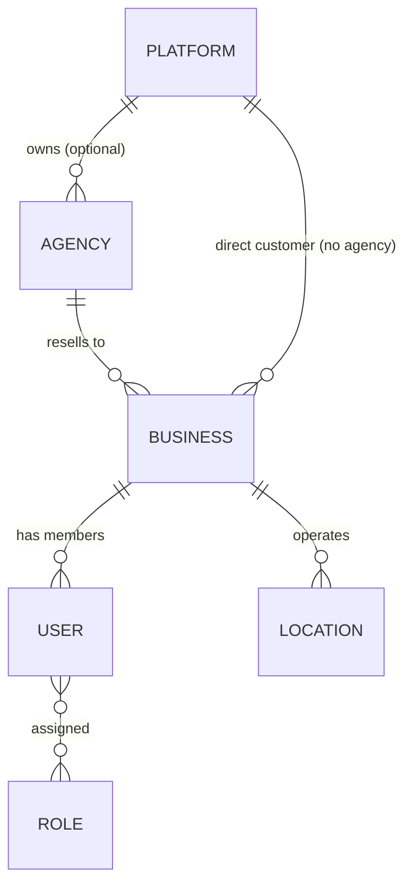
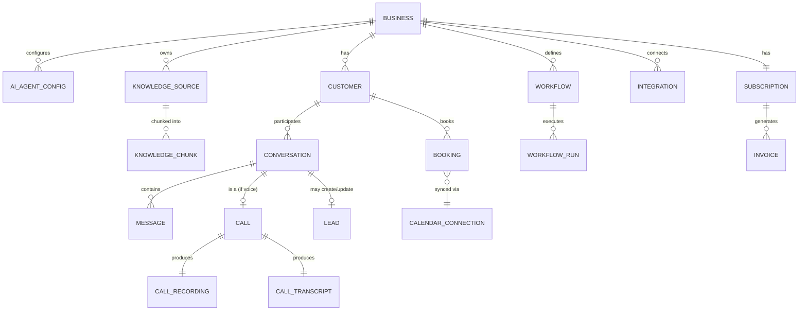

# Pluto AI — Data Model Overview (v1)

Status: **Draft for review — Phase 1**
Last updated: 2026-07-24

This is the conceptual/logical data model. Full DDL, migrations, and index tuning are a Phase 1
"Database Design" deliverable that follows once this shape is approved — writing exhaustive column
lists now, before the AI engine and CRM modules are designed in detail, would lock in guesses.

## 1. Tenancy hierarchy (every table below hangs off this)

- `agencies` — white-label reseller accounts. Has branding config (logo, colors, custom domain),
  billing terms (revenue share / markup), and a list of owned `businesses`.
- `businesses` — the actual SME tenant. `agency_id` nullable (null = direct Pluto AI customer).
- `users` — humans. A user belongs to exactly one `business` (or is a platform/agency staff member
  via a separate `platform_users` / `agency_users` table — **not the same table**, because platform
  staff must never be reachable through tenant-scoped RLS policies; keeping them in a physically
  separate table is a stronger isolation guarantee than a role flag on a shared `users` table).
- `roles` per business: `owner`, `admin`, `staff`, `read_only`. Platform-level: `platform_admin`,
  `platform_support`. Agency-level: `agency_admin`, `agency_staff`. Full permission matrix lives in
  [`04-security-and-compliance.md`](./04-security-and-compliance.md).

## 2. Core domains

### Identity & configuration
- **`businesses`**: name, slug, timezone, industry, operating_hours (jsonb), status
  (`trial|active|past_due|suspended`), `agency_id`.
- **`ai_agent_configs`**: one active row per business (versioned — see §4). system_prompt,
  voice_id, language, escalation_rules (jsonb), enabled_tools (array), model_routing_policy.
- **`locations`**: for multi-location SMEs (e.g. a clinic with 3 branches) — address, timezone,
  phone_number_id, operating_hours override.
- **`services`** / **`employees`**: what can be booked, and by/with whom — used by the booking
  engine and surfaced to the AI as tools ("book a haircut with Dana at the downtown location").
- **`pricing`**: per-service pricing, referenced by the AI when quoting customers.

### Knowledge base (RAG)
- **`knowledge_sources`**: type (`pdf|docx|csv|url|manual_text|faq`), status
  (`pending|indexing|ready|failed`), source metadata, `business_id`.
- **`knowledge_chunks`**: `source_id`, `business_id` (denormalized for RLS + query performance —
  every chunk query is `WHERE business_id = :tenant AND embedding <=> :query_vec`), `content`,
  `embedding vector(1536)`, `token_count`, `chunk_index`.
- Table is **partitioned by `business_id` hash** once volume warrants it (not required at launch,
  but the column layout supports adding partitioning without a breaking migration).

### Conversations & CRM
- **`customers`**: the CRM contact — name, phone, email, tags (array), custom_fields (jsonb),
  `business_id`. Deduplicated on `(business_id, phone)` where phone is present.
- **`conversations`**: channel (`voice|whatsapp|sms|web_chat|email`), `customer_id`, status
  (`active|completed|escalated`), sentiment (`positive|neutral|negative`, computed post-call),
  summary (generated), started_at/ended_at.
- **`messages`**: individual turns within a conversation — role (`customer|agent|system|tool`),
  content, tool_calls (jsonb), created_at.
- **`calls`**: 1:1 extension of `conversations` for voice — twilio_call_sid, direction
  (`inbound|outbound`), duration_seconds, from_number, to_number.
- **`call_recordings`**: S3 object key, duration, `call_id`.
- **`call_transcripts`**: full transcript text + per-utterance timestamps (jsonb), `call_id`.
- **`leads`**: `customer_id`, source (`voice|whatsapp|...`), qualification_status
  (`new|qualified|disqualified|converted`), extracted_fields (jsonb — whatever the AI pulled out:
  budget, timeline, intent), `conversation_id` (origin).

### Scheduling
- **`calendar_connections`**: provider (`google|outlook|calendly`), OAuth tokens (**encrypted**,
  see §5), sync_status, `business_id`.
- **`bookings`**: `customer_id`, `service_id`, `employee_id`, `location_id`, start_at, end_at
  (stored **UTC**, rendered in business/customer timezone at the edge — see timezone note below),
  status (`confirmed|cancelled|completed|no_show`), external_calendar_event_id, recurrence_rule
  (RFC 5545 RRULE string, nullable).
- Conflict detection is enforced at the application layer against both internal `bookings` and the
  live external calendar (Google/Outlook) at booking time — not solely a DB constraint, since the
  source of truth for "is this slot free" ultimately includes the connected external calendar.

### Workflow automation
- **`workflows`**: trigger (`call.completed|lead.qualified|booking.created|...`), definition
  (jsonb — a DAG of steps: send_sms, update_crm_field, create_task, call_webhook, escalate_to_human),
  `business_id`, enabled.
- **`workflow_runs`**: `workflow_id`, trigger_payload, status (`running|succeeded|failed`),
  step_results (jsonb), for debuggability — a workflow that silently fails is worse than one that's
  visibly broken.

### Billing
- **`subscriptions`**: Stripe subscription id, plan, status, `business_id` or `agency_id`
  (agencies can be billed for their whole portfolio — see white-label billing model, deferred to
  Phase 4).
- **`invoices`**, **`usage_records`** (for usage-based billing components: call minutes, SMS sent,
  AI tokens consumed — metered and reconciled against Stripe usage records).

### Platform-wide
- **`webhooks`**: `business_id`, target_url, subscribed_events (array), secret (for HMAC signing of
  outbound payloads).
- **`api_keys`**: `business_id`, hashed key (never store raw), scopes, last_used_at.
- **`feature_flags`** / **`feature_flag_overrides`**: platform-wide default + per-tenant override.
- **`audit_logs`**: append-only — see §4.

## 3. Timezone handling

All timestamps are stored in UTC. Every `business` and `location` has an IANA timezone
(`America/New_York`, not a UTC offset — offsets don't account for DST). All display, booking-slot
generation, and "is it within operating hours" logic converts UTC → business timezone at the point
of use, never the reverse. Customer-facing timestamps (SMS/WhatsApp confirmations) render in the
*customer's* timezone when known (inferred from phone number country code as a fallback, explicit
if collected).

## 4. Soft deletes, versioning, and audit — the actual mechanism

**Decision: not full event sourcing.** Event sourcing (rebuilding entity state by replaying an
immutable event log) gives perfect auditability and replay but adds meaningful complexity — every
read needs a projection, every schema change needs an event-migration story. That cost is justified
for a small number of entities where replay genuinely matters; it is not justified platform-wide.

- **Soft deletes**: every tenant-owned table has `deleted_at timestamptz null`. Application queries
  and RLS policies both filter `deleted_at IS NULL` by default. Hard deletes only happen via an
  explicit, audited data-retention job (GDPR erasure requests — see §5 in the security doc).
- **Optimistic concurrency**: mutable entities that can be edited concurrently (`ai_agent_configs`,
  `workflows`, `bookings`) carry a `version integer` column, incremented on every update; writes
  include `WHERE version = :expected_version` and fail with a conflict if stale — prevents a classic
  SaaS bug where two admins editing the same AI config simultaneously silently clobber each other.
- **Audit log** (`audit_logs`): append-only table, no update/delete grants at the DB role level.
  Every mutating action writes one row: `actor_id, actor_type (user|system|api_key), action,
  entity_type, entity_id, business_id, before (jsonb), after (jsonb), created_at`. This is the
  general-purpose "who changed what" trail required for SOC2 and for customer support debugging.
- **Targeted event sourcing (the exception)**: the **conversation/call state machine** *is* event-sourced
  (`conversation_events`: `state_entered`, `tool_called`, `escalated`, `transferred`, etc.), because
  replaying exactly what an AI agent did during a call — in order, with full tool-call inputs/outputs —
  is a real, recurring need (debugging bad AI behavior, dispute resolution, compliance review of a
  specific call). This is the one place the added complexity pays for itself immediately.

## 5. Encryption of sensitive fields

Field-level encryption (application-layer, via envelope encryption through AWS KMS — not just
disk-level RDS encryption, which doesn't protect against a compromised DB credential) applies to:
OAuth tokens (`calendar_connections`, CRM integration tokens), API keys/secrets for third-party
integrations, and payment-adjacent fields not already tokenized by Stripe. Everything else relies on
RDS encryption-at-rest + TLS in transit, which is sufficient for non-credential business data.

---

Next: [`03-ai-and-voice-architecture.md`](./03-ai-and-voice-architecture.md)
