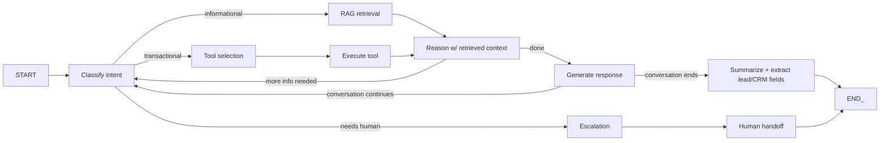
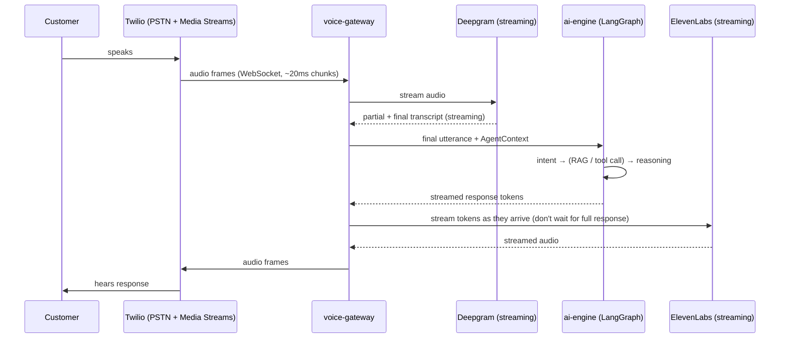

# Pluto AI — AI Engine & Voice Pipeline Architecture (v1)

Status: **Draft for review — Phase 1**
Last updated: 2026-07-24

## 1. Every business has its own AI — what that means structurally

An `ai_agent_config` is not a prompt string. It's a composed configuration the orchestrator resolves
at the start of every conversation:

```
AgentContext {
  system_prompt          # base instructions, editable by the business
  business_profile       # name, industry, operating_hours, locations, policies
  services + pricing     # what can be sold/booked, and at what price
  employees              # who can be booked with
  escalation_rules       # when to transfer to a human, and to whom/how
  voice_id + language    # ElevenLabs voice, primary + fallback language
  enabled_tools          # subset of the global tool registry this business may call
  memory                 # summarized history with this specific customer, if returning caller
  knowledge_retriever    # bound to this business_id's knowledge_chunks partition
}
```

This context is assembled once per conversation start and passed through the LangGraph run — no
tool or prompt in the system ever queries "which business is this" mid-flow; it's resolved once,
scoped, and immutable for the conversation's duration.

## 2. Orchestration: LangGraph agent design

**Why LangGraph over a hand-rolled loop or plain LangChain agent executor:** the receptionist's
behavior is inherently stateful and branchy (greet → identify intent → maybe retrieve knowledge →
maybe call a tool → maybe escalate → maybe book → confirm → close), and calls can be interrupted,
resumed, or transferred mid-flow. LangGraph's explicit state graph makes that control flow
inspectable and testable (each node is independently unit-testable) instead of buried in prompt
engineering alone. Plain LangChain chains are used only where genuinely simple (e.g., a single
summarization call after a conversation ends) — not forced everywhere "because it's in the stack."

Graph shape (conceptual, not final node names):



Every tool call and state transition is persisted as a `conversation_event` (per the targeted
event-sourcing decision in the data model doc), which is what makes call debugging and replay
possible.

## 3. Model routing — not a single hardcoded provider

**Options**

| | Single hardcoded provider | Model router abstraction across OpenAI / Anthropic / Gemini |
|---|---|---|
| Simplicity | Highest | One more abstraction layer |
| Vendor risk | High — an outage or pricing change on one provider is a platform-wide incident | Low — fallback provider absorbs an outage |
| Cost optimization | None | Can route cheap/fast intent-classification calls to a smaller/cheaper model and reserve the strongest model for actual customer-facing reasoning |
| Per-tenant customization | Not possible | A business (or Pluto AI internally) can pin a specific model per use case if one provider handles their industry's terminology better |

**Recommendation:** a thin `ModelRouter` interface (`ai-engine/model_router`) with one adapter per
provider, selected per **task type**, not globally:

- Intent classification / lightweight extraction: fastest/cheapest available model (cost-sensitive,
  runs on every turn).
- Core conversational reasoning (what the customer hears): the strongest available model within the
  latency budget — this is the one call in the loop that's on the critical path to the customer's
  ear, so provider/model choice here is also a latency decision, not just a quality one.
  Provider chosen here is configurable per-business (some verticals — legal, medical — may require a
  specific model for compliance/quality reasons).
  Failover: if the primary provider errors or exceeds a latency threshold, the router retries once
  against a fallback provider before surfacing an error to the conversation.
- Post-call analysis (summarization, sentiment, lead extraction): batched, not latency-sensitive,
  runs on cheapest capable model.

No call site imports `openai` or `anthropic` SDKs directly — everything goes through the router, so
adding a provider or changing a routing policy is a config change, not a code change scattered
across the codebase.

## 4. RAG pipeline

**Ingestion** (async, via `services/knowledge-ingestion` + Celery workers, never blocking the
upload request):

```
Upload (PDF/DOCX/CSV) or URL submitted
  → Extract text (per-type parser; website crawl respects robots.txt, depth-limited)
  → Chunk (semantic chunking, ~500 token target, 15% overlap)
  → Embed (batched calls to the configured embedding model)
  → Store in knowledge_chunks (business_id-scoped)
  → Mark knowledge_source status = ready
  → Emit knowledge_source.indexed event (webhook-visible to the tenant if they want a callback)
```

Failure at any step marks the source `failed` with a human-readable reason surfaced in the
dashboard (never a silent failure — a business whose KB failed to index and doesn't know it will
have an AI that "hallucinates" answers with no visibility into why).

**Retrieval** (synchronous, in the latency-critical path during a live conversation): top-k vector
similarity search scoped to `business_id`, combined with a lightweight keyword/BM25 pass for exact
term matches (pricing, product names) that pure embedding similarity sometimes misses — hybrid
retrieval, not vector-only, because SME knowledge bases are often short and highly specific (exact
policy wording, exact prices) where recall on exact terms matters more than it does in
general-purpose RAG.

## 5. Voice pipeline — the 2-second latency budget



**Budget breakdown (target, p95):**

| Stage | Target | Note |
|---|---|---|
| Audio frame → Deepgram partial | ~150ms | Streaming STT, not batch |
| End-of-utterance detection (VAD/endpointing) | ~200–300ms | Tuned to avoid cutting off customers who pause mid-sentence, the classic bad-IVR failure mode |
| Intent + retrieval + reasoning (LLM time-to-first-token) | ~500–700ms | The dominant cost — this is why streaming matters everywhere else in the chain, to hide this behind pipeline overlap |
| TTS time-to-first-audio-byte | ~150–250ms | Streaming TTS starts speaking before the full response is generated |
| Network/jitter buffer | ~100–150ms | Twilio media stream + WebSocket overhead |
| **Total** | **~1.1–1.6s**, budget ceiling 2s | Leaves headroom for provider-side variance before breaching the target |

The single highest-leverage engineering decision for hitting this budget is **streaming end-to-end,
never batching a stage**: STT streams partials, the LLM call streams tokens, TTS starts synthesizing
on the first sentence-worth of tokens rather than waiting for the full response, and audio is
streamed back to Twilio incrementally. A naive implementation that waits for a full transcript, then
a full LLM response, then generates full audio, would blow the budget by 2–4x even with the exact
same underlying providers.

**Barge-in (customer interrupts the AI mid-sentence):** `voice-gateway` monitors the inbound stream
for speech energy while TTS is playing outbound audio; on detected speech, it immediately halts TTS
playback and flushes the current turn, rather than letting the AI finish talking over the customer.
This is a hard requirement for the receptionist to feel natural, not an optimization.

**Deployment shape:** covered in the system architecture doc (§7, §9) — stateful, call-affine ECS
Fargate tasks, scaled by concurrent-call count, not request count.

## 6. Escalation & human handoff

`escalation_rules` on `ai_agent_configs` define trigger conditions (explicit customer request,
sentiment drops below threshold, N failed clarification attempts, a configured list of "always
escalate" intents like complaints or emergencies). On trigger, `voice-gateway` executes a Twilio
warm-transfer to a configured number, with a spoken summary of the conversation-so-far handed to the
receiving human ("transferring a customer asking about X, sentiment negative, wants Y") rather than
a cold transfer with zero context.

---

Next: [`04-security-and-compliance.md`](./04-security-and-compliance.md)
