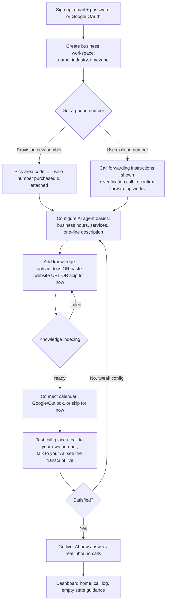
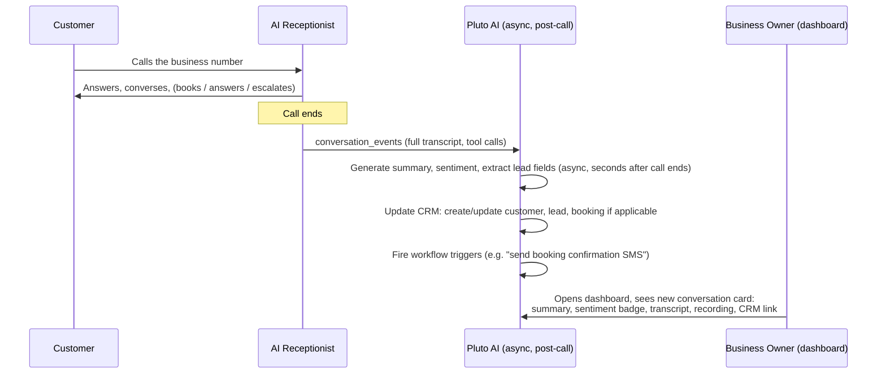
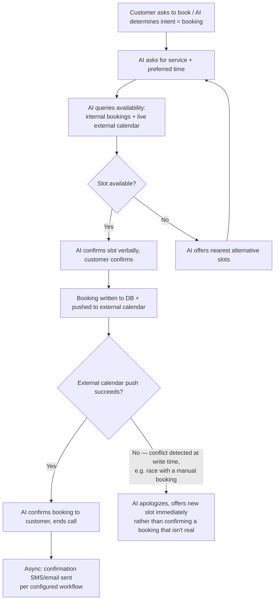
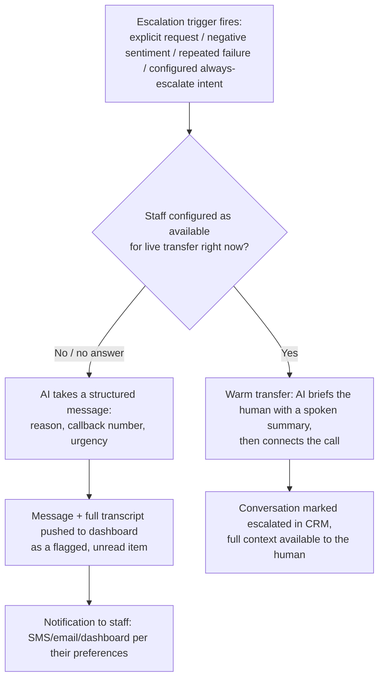
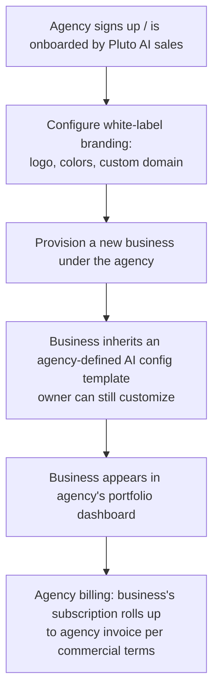
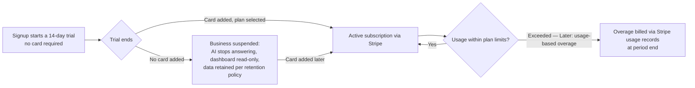
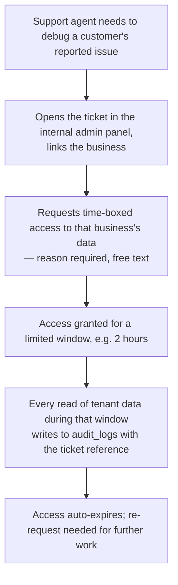

# Pluto AI — User Flows (v1)

Status: **Draft for review — Phase 1**
Last updated: 2026-07-24

Flows are written at the level of detail needed to derive API endpoints and screens from them in
the next doc (`03-technical-specifications.md`) — concrete steps and decision points, not vague
narrative.

## 1. Onboarding — signup to first live call (MVP, voice-first per business requirements §4)

This is the single most important flow in the product: it's the activation path, and every extra
step here is a drop-off risk.

**Key product decisions this flow implies:**
- Knowledge base and calendar connection are both **skippable** — the AI must be able to go live in
  a degraded-but-useful mode (answer questions from the system prompt/business basics alone, take a
  message instead of booking) rather than blocking activation on every integration being complete.
  This directly serves the time-to-live metric from the requirements doc.
- The test call step is not optional — letting an owner hear their AI before it takes a real call is
  the trust-building moment of the whole flow, and it surfaces obviously-wrong config (bad voice,
  wrong hours) before a real customer does.

## 2. Inbound call — customer-facing and business-facing views of the same event

Technical sequence is in `docs/architecture/03-ai-and-voice-architecture.md` §5. This is the product
view: what the business owner sees afterward.

The dashboard conversation view is the single highest-traffic screen for an active business owner —
it's the "did the AI do its job" trust check they'll come back to repeatedly, especially in the
first weeks after going live.

## 3. Booking flow (via voice, MVP)

The race-condition branch (H → J) matters at scale: two customers (or a customer and a staff member
booking manually in Google Calendar directly) can contend for the same slot. The write path treats
the external calendar as the final source of truth at commit time, not just at read time — the AI
never confirms a booking to a customer before that write has actually succeeded.

## 4. Escalation / human handoff (MVP)

## 5. Agency provisioning (Later — Phase 4, flow captured now for data-model completeness)

## 6. Billing lifecycle (MVP: trial → paid; usage overage Later)

## 7. Platform support access (MVP — the audited-access flow from the security doc, as a UX flow)

This flow exists specifically so "platform staff can see customer data" is never an ambient
capability — it's a deliberate, logged, time-boxed action, matching the RBAC design in
`04-security-and-compliance.md` §2.

---

Next: [`03-technical-specifications.md`](./03-technical-specifications.md), which derives the
`api-core` API contract from these flows.
